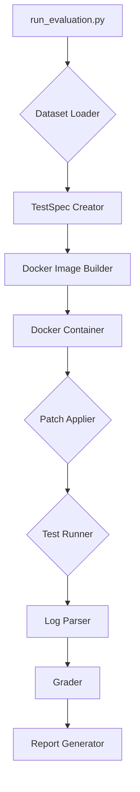

# SWE-bench Architecture

## Architecture Diagram

The SWE-bench evaluation orchestration system consists of several key components that work together to evaluate code patches against real-world GitHub issues. The following diagram provides a high-level overview of the architecture:

## Example Tasks

SWE-bench tasks are based on real-world GitHub issues from popular open-source Python repositories. The goal is to evaluate the ability of language models to resolve these issues by generating a code patch.

### Task Examples:

*   **django/django**: A web framework for perfectionists with deadlines.
    *   *Example Issue*: "Fix a bug in the database query API that causes incorrect results when using certain filters."
*   **sympy/sympy**: A computer algebra system written in pure Python.
    *   *Example Issue*: "Resolve an issue where the symbolic integration of a specific mathematical function returns an incorrect result."
*   **scikit-learn/scikit-learn**: A machine learning library for Python.
    *   *Example Issue*: "Address a performance regression in the k-means clustering algorithm."
*   **sphinx-doc/sphinx**: A Python documentation generator.
    *   *Example Issue*: "Fix a formatting issue in the generated HTML output for a specific documentation directive."
*   **matplotlib/matplotlib**: A comprehensive library for creating static, animated, and interactive visualizations in Python.
    *   *Example Issue*: "Correct the rendering of a plot when using a logarithmic scale with negative values."

An example from the dataset is `django__django-29500`, which corresponds to issue #29500 in the Django repository. The provided solution, PR #10301, modifies 29 files, while a smaller, equivalent patch modifies only 4 files (excluding tests).

## Repository Architecture for Orchestrating Evaluations

The SWE-bench evaluation pipeline is designed for modularity and extensibility. It automates the process of setting up a task environment, applying a candidate patch, and grading the proposed fix.

### Core Components

The system is composed of several key components, each with a specific role in the evaluation process:

*   **Main Evaluation Entry Point (`swebench/harness/run_evaluation.py`)**: This is the orchestrator of the entire evaluation pipeline. It manages command-line arguments, parallel execution, and coordinates the other components to run the evaluation for each task instance.

*   **Test Specification System (`swebench/harness/test_spec/test_spec.py`)**: This component defines the structure and execution of tests. The `TestSpec` class encapsulates all the necessary information for an evaluation, including instance metadata, test commands, and Docker configurations.

*   **Docker Build System (`swebench/harness/docker_build.py`)**: Responsible for creating the isolated Docker environments for each evaluation. It builds the necessary Docker images and creates containers based on the test specifications.

*   **Docker Utilities (`swebench/harness/docker_utils.py`)**: Provides low-level functions for interacting with the Docker daemon, such as executing commands within containers, copying files, and cleaning up resources.

*   **Grading System (`swebench/harness/grading.py`)**: This component determines the success of a patch. It analyzes the test results to verify that the patch fixes the intended issue (`FAIL_TO_PASS`) without introducing regressions (`PASS_TO_PASS`).

*   **Data Loading Utilities (`swebench/harness/utils.py`)**: Handles the loading of the SWE-bench dataset from Hugging Face or local files, as well as parsing the model-generated predictions.

### Evaluation Flow

The evaluation process for a single instance follows these steps:

1.  **`run_evaluation.py`**: The script is invoked with parameters specifying the dataset, predictions, and other configuration options.
2.  **`utils.py`**: The `load_swebench_dataset` and `get_predictions_from_file` functions load the task instances and candidate patches.
3.  **`test_spec.py`**: For each instance, a `TestSpec` is created, defining the evaluation environment and test commands.
4.  **`docker_build.py`**: A dedicated Docker container is built and configured for the specific task instance.
5.  **`docker_utils.py`**: The candidate patch is applied within the container, and the test suite is executed.
6.  **`grading.py`**: The test output is analyzed to produce an evaluation report, indicating whether the patch resolved the issue.
7.  **`run_evaluation.py`**: The final report, summarizing the results for all instances, is generated.

## Reusable Components for New Evaluations

While SWE-bench is tailored for evaluating patches for Python repositories, its modular architecture makes it adaptable for other software engineering tasks and programming languages. The following components are designed for extensibility and can be reused or extended for new evaluation scenarios:

*   **Core Orchestration (`run_evaluation.py`)**: The main evaluation script is largely language-agnostic. It can be used to orchestrate evaluations for any dataset, as long as the instances are provided in the expected format.

*   **Docker-based Environment**: The use of Docker for environment setup is a key feature that promotes reusability. To support a new programming language, you would need to:
    *   Create a new Dockerfile template in `swebench/harness/dockerfiles/`.
    *   Define the installation and test commands for the new language and repositories in `swebench/harness/constants/`.

*   **Test Specification (`TestSpec`)**: The `TestSpec` class is a flexible data structure that can be adapted to different testing frameworks and languages. The `make_test_spec` function can be extended to generate test scripts for new evaluation scenarios.

*   **Log Parsing System**: The `swebench/harness/log_parsers/` directory contains language-specific parsers for extracting test results from the output logs. To support a new testing framework, you would need to add a new parser that can identify pass/fail statuses for each test.

### Extending to New Languages

To extend SWE-bench to a new programming language (e.g., JavaScript, Java, C++), the following steps would be necessary:

1.  **Add a Dockerfile Template**: Create a new file in `swebench/harness/dockerfiles/` (e.g., `javascript.py`) that defines the Dockerfile for the new language's environment.
2.  **Define Constants**: Add a new file in `swebench/harness/constants/` (e.g., `javascript.py`) to specify repository-specific installation and test commands.
3.  **Implement a Log Parser**: Create a new log parser in `swebench/harness/log_parsers/` to extract test results from the output of the new language's testing frameworks.
4.  **Update `make_test_spec`**: Modify the `make_test_spec` function in `swebench/harness/test_spec/test_spec.py` to generate the appropriate test scripts for the new language.